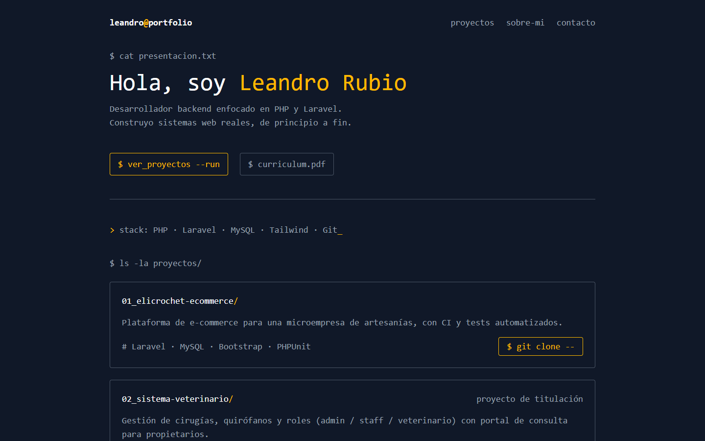
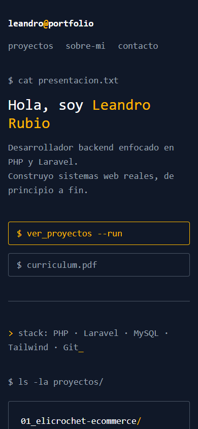

<p align="center">
  
</p>

<h1 align="center">Portafolio — Leandro Rubio</h1>

<p align="center">
  Sitio personal de desarrollador backend con estética de terminal.<br>
  Reúne mis proyectos, mi stack y mi CV en un solo lugar.
</p>

<p align="center">
  
  
  
</p>

<p align="center">
  <strong>Demo:</strong> <a href="https://leandrorubio-73456.github.io/portafolio/">leandrorubio-73456.github.io/portafolio</a>
</p>

---

## Contexto

Un perfil de GitHub muestra repositorios, pero no cuenta qué hace cada uno ni quién está detrás. Este portafolio es la puerta de entrada para reclutadores y clientes: presenta mis proyectos con su contexto y stack, enlaza a cada repositorio y permite descargar mi CV.

## Capturas

<p align="center">
  
  
</p>

## Funciones principales

- **Proyectos** con descripción, stack y enlace directo a cada repositorio.
- **CV descargable** en PDF.
- **Diseño responsive** (mobile-first) con estética de terminal, coherente con un perfil backend.
- **SEO y vista previa al compartir:** meta tags, Open Graph e imagen propia para LinkedIn y redes.
- **Favicons** para navegador, pestañas e iOS.

## Stack tecnológico

- HTML5 semántico, sin JavaScript
- Tailwind CSS 4 compilado con Tailwind CLI
- GitHub Pages para el hosting

## Decisiones técnicas

- **Cero JavaScript.** Es un sitio de contenido: HTML y CSS bastan, así que carga al instante y no hay nada que mantener ni que pueda romperse.
- **Tailwind CLI en lugar del CDN.** El CSS se compila y minifica con solo las clases que se usan, en lugar de cargar un script que genera estilos en el navegador en cada visita.
- **Movimiento respetuoso.** El desplazamiento suave se desactiva para quien tiene activada la opción de reducir movimiento en su sistema.
- **Pensado para compartirse.** Open Graph e imagen propia para que el enlace se vea bien en LinkedIn, WhatsApp y otras redes.

## Instalación

Requisitos: Node.js 20 o superior (solo para compilar el CSS).

```bash
git clone https://github.com/LeandroRubio-73456/portafolio.git
cd portafolio
npm install
npm run build:css
npx serve .
```

| Comando | Descripción |
|---|---|
| `npm run build:css` | Compila y minifica `src/input.css` en `src/output.css` |
| `npm run watch:css` | Recompila el CSS al guardar cambios |

`src/output.css` se versiona en el repositorio, para que GitHub Pages publique el sitio sin un paso de build.

## Estructura del proyecto

```
├── index.html          # Todo el contenido del sitio
├── src/
│   ├── input.css       # Entrada de Tailwind
│   └── output.css      # CSS compilado (lo que carga index.html)
├── assets/             # CV, imagen Open Graph y favicons
└── docs/screenshots/   # Capturas para este README
```

## Autor

Desarrollado por **Leandro Rubio**.

[Portafolio](https://leandrorubio-73456.github.io/portafolio/) · [LinkedIn](https://www.linkedin.com/in/leandro-rubio-369651367/) · leandrorubio456@gmail.com

## Licencia

El código puede usarse como referencia. El contenido personal (textos, CV e imágenes) pertenece a Leandro Rubio.
